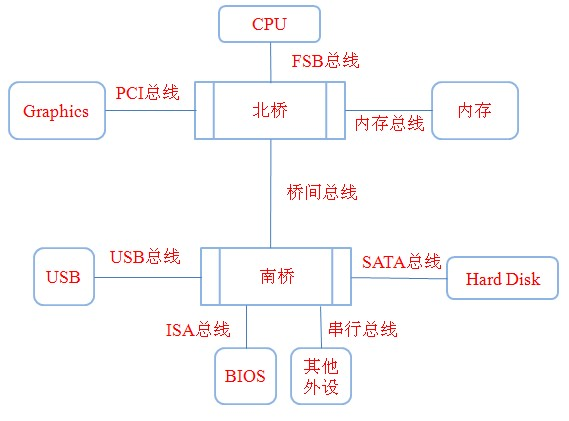
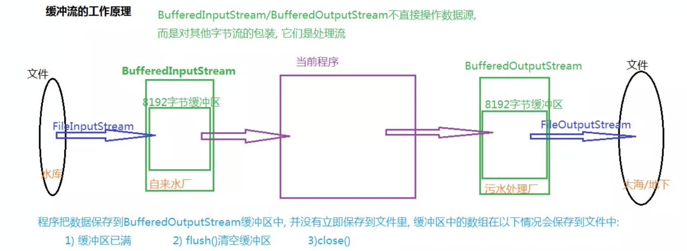
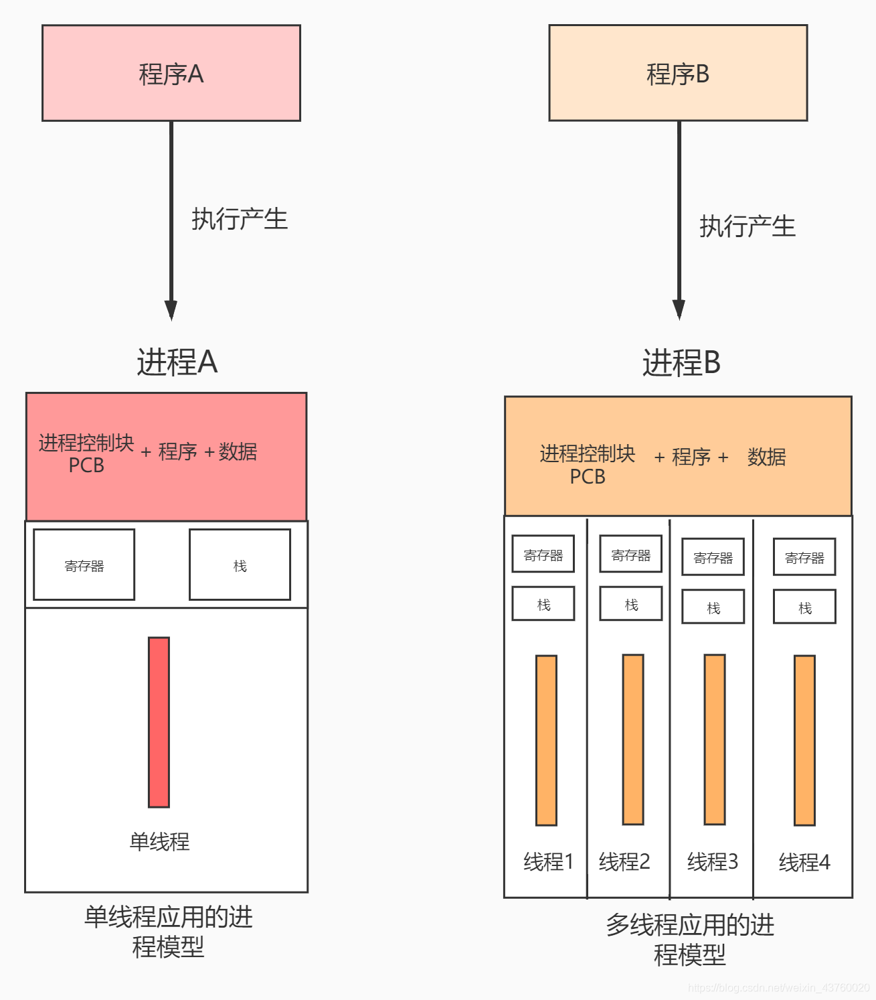
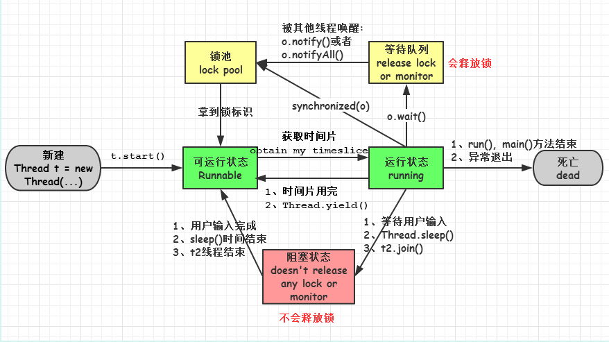
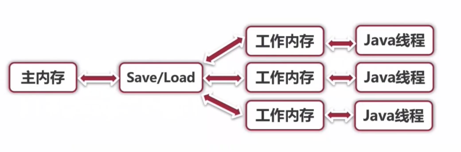
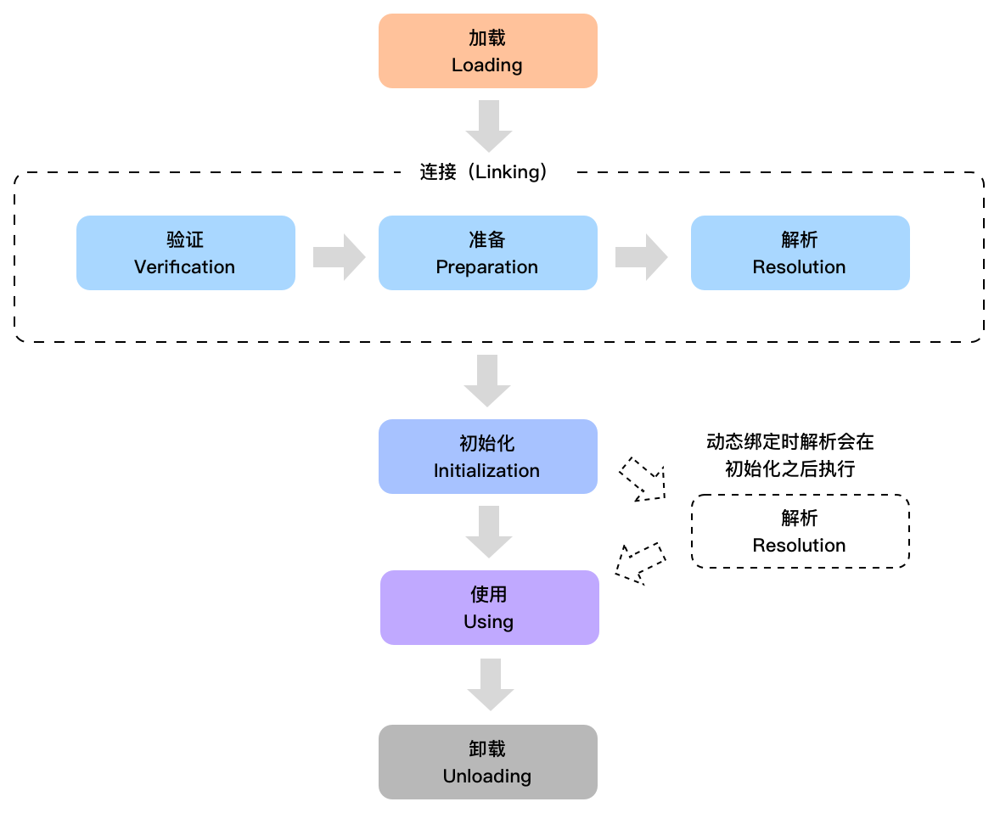
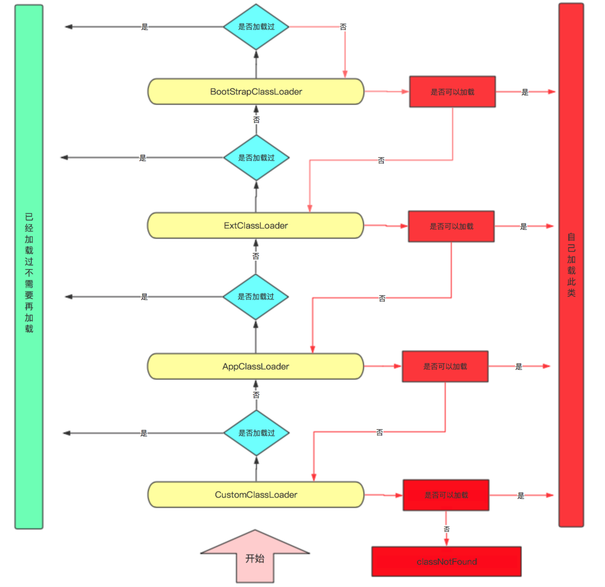

# Java高级



## Java-IO

JDK提供了一套用于IO操作的框架，根据流的传输方向和读取单位，分为字节流InputStream和OutputStream以及字符流Reader和Writer的IO框架。字节流一次读取一个`byte`的大小，而字符流一次读取一个字符，也就是一个char的大小（在读取纯文本的时候更加合适）

## 文件字节流

`FileInputStream`: 用来获取文件的输入流  

```java
FileInputStream stream = new FileInputStream("path to file");
```

### 文件路径

- 可以使用绝对路径

- 也可以使用相对路径,默认路径为当前Main Class的同级目录，比如`src`目录

  

---

## 文件字节输出流

与文件字节输入流类似，如果输出的文件不存在会默认创建，结尾建议使用`.flush()`保证文件写入硬盘


## 文件对象

```java
File file = new File("hello/text.txt")
```


利用`file.createNewFile()`或者`file.mkdir()`返回的布尔值判断是否创建成功。

如果前面路径中的文件夹还没有创建，则使用`file.mkdirs()`即可创建

---

## 缓冲流



缓冲流有**缓冲字符流**和 

要创建一个缓冲字节流，只需要将原本的流作为构造参数传入BufferedInputStream即可：

```java
public static void main(String[] args) {
    try (BufferedInputStream bufferedInputStream = new BufferedInputStream(new FileInputStream("test.txt"))){   //传入FileInputStream
        System.out.println((char) bufferedInputStream.read());   //操作和原来的流是一样的
    }catch (IOException e){
        e.printStackTrace();
    }
}
```

实际上进行I/O操作的并不是BufferedInputStream，而是我们传入的FileInputStream，而BufferedInputStream虽然有着同样的方法，但是进行了一些额外的处理然后再调用FileInputStream的同名方法，这样的写法称为`装饰者模式`.

 IO操作一般不能重复读取内容， 而缓冲流提供了缓冲机制，一部分内容可以被暂时保存，支持`reset()`和`mark()`操作。

- **`reset()`**会使当前读取的位置回到mark()调用时的位置
- mark()的`**readlimit**`属性需要大于缓冲区的大小，并且一旦读取超过后则会使`mark()`失效
- 缓冲输入流可以嵌套

##  数据流

数据流DataInputStream也是FilterInputStream的子类，同样采用装饰者模式，最大的不同是它支持基本数据类型的直接读取

## 对象流

ObjectOutputStream不仅支持基本数据类型，通过对对象的序列化操作，以某种格式保存对象，来支持对象类型的IO，注意：它不是继承自FilterInputStream的。

```java
public static void main(String[] args) {
    try (ObjectOutputStream outputStream = new ObjectOutputStream(new FileOutputStream("output.txt"));
         ObjectInputStream inputStream = new ObjectInputStream(new FileInputStream("output.txt"))){
        People people = new People("lbw");
        outputStream.writeObject(people);
      	outputStream.flush();
        people = (People) inputStream.readObject();
        System.out.println(people.name);
    }catch (IOException | ClassNotFoundException e) {
        e.printStackTrace();
    }
}

static class People implements Serializable{   //必须实现Serializable接口才能被序列化
    String name;

    public People(String name){
        this.name = name;
    }
}
```

```java
static class People implements Serializable{
    private static final long serialVersionUID = 123456;   //在序列化时，会被自动添加这个属性，它代表当前类的版本，我们也可以手动指定版本。

    String name;

    public People(String name){
        this.name = name;
    }
}
```

当发生版本不匹配时，会无法反序列化为对象. 如果我们不希望某些属性参与到序列化中进行保存，我们可以添加`transient`关键字：


---

## 多线程



### `start()`和`run()`的区别

**首先**，系统通过**调用线程类的start（）方法来启动一个线程**，此时这个线程处于就绪状态，而非运行状态，也就意味着这个线程可以被JVM来调度执行。

**然后**，在这个调度执行过程中，JVM会通过**调用线程类的run（）方法来完成实际的操作**，当run（）方法结束后，此线程就会终止。



::: tip 注意：

　　　　如果直接调用线程类的run（）方法，会被当作一个普通的函数来调用。也就是说，start（）方法能够异步地调用run（）方法，但是直接调用run（）方法却是同步的，因此无法达到多线程的目的。

　　　　只有通过调用线程类的start（）方法才能真正达到多线程的目的。

:::

---

### 线程的礼让和加入

- 使用`yield()`方法来将当前资源让位给其他同优先级线程
- 使用`join()`方法来实现线程的加入

注意，线程的加入只是等待另一个线程的完成，并不是将另一个线程和当前线程合并！


---

### 线程锁和线程同步

多线程情况下Java的多线程内存管理：



高速缓存通过保存内存中数据的副本来提供更加快速的数据访问，但是如果多个处理器的运算任务都涉及同一块内存区域，就可能导致各自的高速缓存数据不一致，在写回主内存时就会发生冲突，这就是引入高速缓存引发的新问题，称之为：**缓存一致性**。

###  线程锁`synchonized`

 通过synchronized关键字来创造一个线程锁，首先我们来认识一下synchronized代码块，它需要在括号中填入一个内容，必须是一个对象或是一个类，我们在value自增操作外套上同步代码块：

```java
private static int value = 0;

public static void main(String[] args) throws InterruptedException {
    Thread t1 = new Thread(() -> {
        for (int i = 0; i < 10000; i++) {
            synchronized (Main.class){  //使用synchronized关键字创建同步代码块
                value++;
            }
        }
        System.out.println("线程1完成");
    });
    Thread t2 = new Thread(() -> {
        for (int i = 0; i < 10000; i++) {
            synchronized (Main.class){
                value++;
            }
        }
        System.out.println("线程2完成");
    });
    t1.start();
    t2.start();
    Thread.sleep(1000);  //主线程停止1秒，保证两个线程执行完成
    System.out.println(value);
}
```

我们发现，现在得到的结果就是我们想要的内容了，因为在同步代码块执行过程中，拿到了我们传入对象或类的锁（传入的如果是对象，就是对象锁，不同的对象代表不同的对象锁，如果是类，就是类锁，类锁只有一个，实际上类锁也是对象锁，是Class类实例，但是Class类实例同样的类无论怎么获取都是同一个），但是注意两个线程必须使用同一把锁！

当一个线程进入到同步代码块时，会获取到当前的锁，而这时如果其他使用同样的锁的同步代码块也想执行内容，就必须等待当前同步代码块的内容执行完毕，在执行完毕后会自动释放这把锁，而其他的线程才能拿到这把锁并开始执行同步代码块里面的内容（实际上synchronized是一种悲观锁，随时都认为有其他线程在对数据进行修改

synchronized关键字也可以作用于方法上，调用此方法时也会获取锁：

### wait和notify方法

对象的`wait()`方法会暂时使得此线程进入等待状态，同时会释放当前代码块持有的锁，这时其他线程可以获取到此对象的锁，当其他线程调用对象的`notify()`方法后，会唤醒刚才变成等待状态的线程（这时并没有立即释放锁）。注意，必须是在持有锁（同步代码块内部）的情况下使用，否则会抛出异常！

notifyAll其实和notify一样，也是用于唤醒，但是前者是唤醒所有调用`wait()`后处于等待的线程，而后者是看运气随机选择一个。

### 守护线程

当其他所有的非守护线程结束之后，守护线程自动结束，也就是说，Java中所有的线程都执行完毕后，守护线程自动结束，因此守护线程不适合进行IO操作

```java
public static void main(String[] args) throws InterruptedException{
    Thread t = new Thread(() -> {
        while (true){
            try {
                System.out.println("程序正常运行中...");
                Thread.sleep(1000);
            } catch (InterruptedException e) {
                e.printStackTrace();
            }
        }
    });
    t.setDaemon(true);   //设置为守护线程（必须在开始之前，中途是不允许转换的）
    t.start();
    for (int i = 0; i < 5; i++) {
        Thread.sleep(1000);
    }
}
```

在守护线程中产生的新线程也是守护的。

---

## 反射

反射就是把Java类中的各个成分映射成一个个的Java对象。即在运行状态中，对于任意一个类，都能够知道这个类所有的属性和方法，对于任意一个对象，都能调用它的任意一个方法和属性。这种动态获取信息及动态调用对象方法的功能叫Java的反射机制。

简而言之，我们可以通过反射机制，获取到类的一些属性，包括类里面有哪些字段，有哪些方法，继承自哪个类，甚至还能获取到泛型！

### Java类加载机制



在Java程序启动时，JVM会将一部分类（class文件）先加载（并不是所有的类都会在一开始加载），通过ClassLoader将类加载，在加载过程中，会将类的信息提取出来（存放在元空间中，JDK1.8之前存放在永久代），同时也会生成一个Class对象存放在内存（堆内存），注意此Class对象只会存在一个，与加载的类唯一对应！

通过反射获取**Class**:

```java
public static void main(String[] args) throws ClassNotFoundException {
    Class<String> clazz = String.class;   //使用class关键字，通过类名获取
    Class<?> clazz2 = Class.forName("java.lang.String");   //使用Class类静态方法forName()，通过包名.类名获取，注意返回值是Class<?>
    Class<?> clazz3 = new String("cpdd").getClass();  //通过实例对象获取
}
```

::: tip

实际上，基本数据类型也有对应的Class对象（反射操作可能需要用到），而且我们不仅可以通过class关键字获取，其实本质上是定义在对应的包装类中的.

基本类型的Class和其包装类的Class是不一样的。

每个包装类中（包括Void），都有一个获取原始类型Class方法，注意，getPrimitiveClass获取的是原始类型，并不是包装类型，只是可以使用包装类来表示。

:::

### 创建类对象

既然我们拿到了类的定义，那么是否可以通过Class对象来创建对象、调用方法、修改变量呢？当然是可以的，那我们首先来探讨一下如何创建一个类的对象：通过使用`newInstance()`方法来创建对应类型的实例，返回泛型T。当类默认的构造方法被带参构造覆盖时，会出现InstantiationException异常，因为`newInstance()`只适用于默认无参构造。当默认无参构造的权限不是`public`时，会出现IllegalAccessException异常，表示我们无权去调用默认构造方法。在JDK9之后，不再推荐使用`newInstance()`方法了。通过获取类的构造方法（构造器）来创建对象实例，会更加合理，我们可以使用`getConstructor()`方法来获取类的构造方法，同时我们需要向其中填入参数，也就是构造方法需要的类型。

```java
public static void main(String[] args) throws NoSuchMethodException, InvocationTargetException, InstantiationException, IllegalAccessException {
    Class<Student> clazz = Student.class;
    Student student = clazz.getConstructor(String.class).newInstance("what's up");
    student.test();
}

static class Student{

    private Student(String str){}

    public void test(){
        System.out.println("萨日朗");
    }
}
```

::: tip

使用`getDeclaredConstructor()`方法可以找到类中的非public构造方法，但是在使用之前，我们需要先修改访问权限，在修改访问权限之后，就可以使用非public方法了（这意味着，反射可以无视权限修饰符访问类的内容）.

将反射得到的方法调用权限修饰符：`setAccessible(true)`

```java
public static void main(String[] args) throws ReflectiveOperationException {
    Class<?> clazz = Class.forName("com.test.Student");
    Object instance = clazz.newInstance();   //创建出学生对象
    Method method = clazz.getDeclaredMethod("test", String.class);   //通过方法名和形参类型获取类中的方法
    method.setAccessible(true);

    method.invoke(instance, "what's up");   //通过Method对象的invoke方法来调用方法
}
```


:::

可变参数实际上就是一个数组，因此我们可以直接使用数组的class对象表示.

### 双亲委派机制流程图




## 注解

其实我们在之前就接触到注解了，比如`@Override`表示重写父类方法（当然不加效果也是一样的，此注解在编译时会被自动丢弃）注解本质上也是一个类，只不过它的用法比较特殊。

注解可以被标注在任意地方，包括方法上、类名上、参数上、成员属性上、注解定义上等，就像注释一样，它相当于我们对某样东西的一个标记。而与注释不同的是，注解可以通过反射在运行时获取，注解也可以选择是否保留到运行时。

### 预设注解

JDK预设了以下注解，作用于代码：

- @Override- 检查（仅仅是检查，不保留到运行时）该方法是否是重写方法。如果发现其父类，或者是引用的接口中并没有该方法时，会报编译错误。
- @Deprecated  - 标记过时方法。如果使用该方法，会报编译警告。
- @SuppressWarnings- 指示编译器去忽略注解中声明的警告（仅仅编译器阶段，不保留到运行时）
- @FunctionalInterface - Java 8 开始支持，标识一个匿名函数或函数式接口。
- @SafeVarargs - Java 7 开始支持，忽略任何使用参数为泛型变量的方法或构造函数调用产生的警告。

### 元注解

元注解是作用于注解上的注解，用于我们编写自定义的注解：

- @Retention - 标识这个注解怎么保存，是只在代码中，还是编入class文件中，或者是在运行时可以通过反射访问。
- @Documented - 标记这些注解是否包含在用户文档中。
- @Target - 标记这个注解应该是哪种 Java 成员。
- @Inherited - 标记这个注解是继承于哪个注解类(默认 注解并没有继承于任何子类)
- @Repeatable - Java 8 开始支持，标识某注解可以在同一个声明上使用多次。

### 注解的使用

我们还可以在注解中定义一些属性，注解的属性也叫做成员变量，注解只有成员变量，没有方法。注解的成员变量在注解的定义中以“无形参的方法”形式来声明，其方法名定义了该成员变量的名字，其返回值定义了该成员变量的类型：

```java
@Target({ElementType.METHOD, ElementType.TYPE})
@Retention(RetentionPolicy.RUNTIME)
public @interface Test {
    String value();
}
```

::: tip

默认只有一个属性时，我们可以将其名字设定为value，否则，我们需要在使用时手动指定注解的属性名称，使用value则无需填入,也可以使用default关键字来为这些属性指定默认值.


当属性为数组，我们在使用注解传参时，如果数组里面只有一个内容，我们可以直接传入一个值，而不是创建一个数组.

多个值时就使用花括号括起来 `@Test({"value1", "value2"})`   

:::

通过反射机制，我们可以快速获取到我们标记的注解，同时还能获取到注解中填入的值.

无论是方法、类、还是字段，都可以使用`getAnnotations()`方法（还有几个同名的）来快速获取我们标记的注解.
