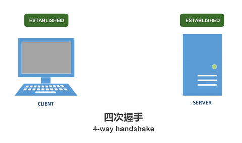

# JavaWeb

## 网络通信协议

OSI七层网络模型

## TCP/IP 四层模型

**TCP/IP 四层模型** 是目前被广泛采用的一种模型,我们可以将 TCP / IP 模型看作是 OSI 七层模型的精简版本，由以下 4 层组成：

1. 应用层
2. 传输层
3. 网络层
4. 网络接口层

需要注意的是，我们并不能将 TCP/IP 四层模型 和 OSI 七层模型完全精确地匹配起来，不过可以简单将两者对应起来

互联网协议族（英语：Internet Protocol Suite，缩写IPS）是一个网络通信模型，以及一整个网络传输协议家族，为互联网的基础通信架构。它常被通称为TCP/IP协议族（英语：TCP/IP Protocol Suite，或TCP/IP Protocols），简称TCP/IP。TCP（传输控制协议）和IP（网际协议），为该家族中最早通过的标准。
TCP/IP提供点对点的链接机制，将数据应该如何封装、定址、传输、路由以及在目的地如何接收，都加以标准化。它将软件通信过程抽象化为四个抽象层，采取协议堆栈的方式，分别实现出不同通信协议。协议族下的各种协议，依其功能不同，被分别归属到这四个层次结构之中，常被视为是简化的七层OSI模型。TCP/IP模型各个层次的功能和协议如下：

---

## TCP协议

TCP是面向连接的协议，这是因为在一个应用进程可以开始向另一个应用进程发送数据之前，这两个进程必须先相互“握手”，即它们必须相互发送某些预备报文段，以建立确保数据传输的参数。它有以下几个特点：

- **面向连接**：TCP一定是“一对一”的，无法像 UDP 协议那样在同一时刻像多个主机发送消息，即无法做到一对多；
- **可靠的**：无论的网络链路中出现了怎样的链路变化，TCP 都可以保证一个报文一定能够到达接收端（当然不是说绝对可靠）；
- **基于字节流**：消息是“没有边界”的，所以无论我们消息有多大都可以进行传输。并且消息是“有序的”，当前一个消息没有收到的时候，即使它先收到了后面的字节已经收到，那么也不能扔给应用层去处理，同时对重复的报文会自动丢弃。

---

## UDP协议

UDP(User Datagram Protocol)即用户数据报协议，在网络中它与TCP协议一样用于处理数据包，是一种无连接的协议。在OSI模型中，在第四层——传输层，处于IP协议的上一层。UDP用来支持那些需要在计算机之间传输数据的网络应用。包括网络视频会议系统在内的众多的客户/服务器模式的网络应用都需要使用UDP协议。UDP协议从问世至今已经被使用了很多年，虽然其最初的光彩已经被一些类似协议所掩盖，但是即使是在今天UDP仍然不失为一项非常实用和可行的网络传输层协议。UDP报文没有可靠性保证、顺序保证和流量控制字段等，可靠性较差。但是正因为UDP协议的控制选项较少，在数据传输过程中延迟小、数据传输效率高，适合对可靠性要求不高的应用程序，或者可以保障可靠性的应用程序，如DNS、TFTP、SNMP等

---

## HTTP协议

HTTP协议是Hyper Text Transfer Protocol（超文本传输协议）的缩写,是用于从万维网（WWW:World Wide Web ）服务器传输超文本到本地浏览器的传送协议。

HTTP是一个基于TCP/IP通信协议来传递数据（HTML 文件, 图片文件, 查询结果等）。

HTTP是一个属于应用层的面向对象的协议，由于其简捷、快速的方式，适用于分布式超媒体信息系统。

### 主要特点

1、简单快速：客户向服务器请求服务时，只需传送请求方法和路径。请求方法常用的有GET、HEAD、POST。每种方法规定了客户与服务器联系的类型不同。由于HTTP协议简单，使得HTTP服务器的程序规模小，因而通信速度很快。

2、灵活：HTTP允许传输任意类型的数据对象。正在传输的类型由Content-Type加以标记。

3.无连接：无连接的含义是限制每次连接只处理一个请求。服务器处理完客户的请求，并收到客户的应答后，即断开连接。采用这种方式可以节省传输时间。

4.无状态：HTTP协议是无状态协议。无状态是指协议对于事务处理没有记忆能力。缺少状态意味着如果后续处理需要前面的信息，则它必须重传，这样可能导致每次连接传送的数据量增大。另一方面，在服务器不需要先前信息时它的应答就较快。
5、支持B/S及C/S模式。

HTTP使用统一资源标识符（Uniform Resource Identifiers, URI）来传输数据和建立连接。URL是一种特殊类型的URI，包含了用于查找某个资源的足够的信息

URL,全称是UniformResourceLocator, 中文叫统一资源定位符,是互联网上用来标识某一处资源的地址。

---

## TCP 的三次握手

- 一开始，客户端和服务端都处于 `CLOSED` 状态。客户端主动打开连接，服务端被动打开连接，结束`CLOSED` z状态，开始监听，进入 `LISTEN`状态。

**一次握手**

- 客户端会随机初始化序号（`client_isn`），将此序号置于 TCP 首部的「序号」字段中，同时把 `SYN` 标志位置为 `1` ，表示 `SYN` 报文。接着把第一个 SYN 报文发送给服务端，表示向服务端发起连接，该报文不包含应用层数据，之后客户端处于 `SYN-SENT` 状态。

**二次握手**

- 服务端收到客户端的 `SYN` 报文后，首先服务端也随机初始化自己的序号（`server_isn`），将此序号填入 TCP 首部的「序号」字段中，其次把 TCP 首部的「确认应答号」字段填入 `client_isn + 1`, 接着把 `SYN` 和 `ACK` 标志位置为 `1`。最后把该报文发给客户端，该报文也不包含应用层数据，之后服务端处于 `SYN-RCVD` 状态。

**三次握手**

- 客户端收到服务端报文后，还要向服务端回应最后一个应答报文，首先该应答报文 TCP 首部 `ACK` 标志位置为 `1` ，其次「确认应答号」字段填入 `server_isn + 1` ，最后把报文发送给服务端，这次报文可以携带客户到服务器的数据，之后客户端处于 `ESTABLISHED` 状态。

好了，经过三次握手的过程，客户端和服务端之间的确定连接正常，接下来进入`ESTABLISHED`状态，服务端和客户端就可以快乐地通信了。

### 为什么要三次握手？

三次握手的主要目的是为了确保双方的连接建立是可靠的，并且双方都具备发送和接收数据的能力。具体原因如下：

1. **确保双方收到对方的初始序列号**：客户端发送SYN包，服务器回复SYN-ACK包，客户端再回复ACK包，确保双方都接收到对方的序列号。
2. **防止重复的连接初始化**：如果网络中存在旧的连接请求包，三次握手可以确保不会因为这些旧包而错误地建立连接。
3. **同步序列号**：在建立连接时，双方需要同步各自的序列号，以确保后续数据传输的顺序和完整性。

---

## TCP四次挥手

聚散终有时，TCP 断开连接是通过**四次挥手**方式。

`双方`都可以主动断开连接，断开连接后主机中的「资源」将被释放。

上图是客户端主动关闭连接 ：

**一次挥手**

- 客户端打算关闭连接，此时会发送一个 TCP 首部 `FIN` 标志位被置为 `1` 的报文，也即 `FIN` 报文，之后客户端进入 `FIN_WAIT_1` 状态。

**二次挥手**

- 服务端收到该报文后，就向客户端发送 `ACK` 应答报文，接着服务端进入 `CLOSED_WAIT` 状态。

**三次挥手**

- 客户端收到服务端的 `ACK` 应答报文后，之后进入 `FIN_WAIT_2` 状态。等待服务端处理完数据后，也向客户端发送 `FIN` 报文，之后服务端进入 `LAST_ACK` 状态。

**四次挥手**

- 客户端收到服务端的 `FIN` 报文后，回一个 `ACK` 应答报文，之后进入 `TIME_WAIT` 状态
- 服务器收到了 `ACK` 应答报文后，就进入了 `CLOSED` 状态，至此服务端已经完成连接的关闭。
- 客户端在经过 `2MSL` 一段时间后，自动进入 `CLOSED` 状态，至此客户端也完成连接的关闭。

你可以看到，每个方向都需要**一个 FIN 和一个 ACK**，因此通常被称为**四次挥手**。

### 为什么要四次挥手？

四次挥手的主要目的是为了确保双方都已经完全准备好关闭连接，避免数据丢失或中断。具体原因如下：

1. **双向关闭**：TCP连接是全双工的，需要双方分别关闭发送和接收信道。四次挥手确保双方都确认了关闭操作。
2. **数据传输完毕**：通过FIN和ACK的交换，确保所有数据都已传输和接收完毕，没有遗漏。
3. **避免资源浪费**：确保双方的连接资源都已释放，防止因未完全关闭连接而造成资源浪费。

### 为什么`TIME_WAIT`要等待2MSL？

在挥手过程中，客户端在发送最后一个ACK包后会进入一个称为`TIME_WAIT`状态，持续2MSL（Maximum Segment Lifetime，最大报文段生存时间）。主要原因如下：

1. **确保最后的ACK包被接收**：如果服务器没有收到最后的ACK包，会重发FIN包。客户端处于`TIME_WAIT`状态可以确保它有足够的时间接收和处理重发的FIN包，再次发送ACK包。
2. **防止旧连接数据混淆**：2MSL的等待时间确保了连接的旧数据包在网络中消失，避免新连接中出现旧连接的数据包混淆。

---

## Socket技术

我们可以通过Socket技术（它是计算机之间进行**通信**的**一种约定**或一种方式），实现两台计算机之间的通信，Socket也被翻译为`套接字`，是操作系统底层提供的一项通信技术，它支持TCP和UDP。而Java就对Socket底层支持进行了一套完整的封装，我们可以通过Java来轻松实现Socket通信。