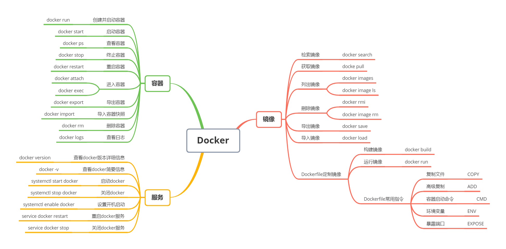
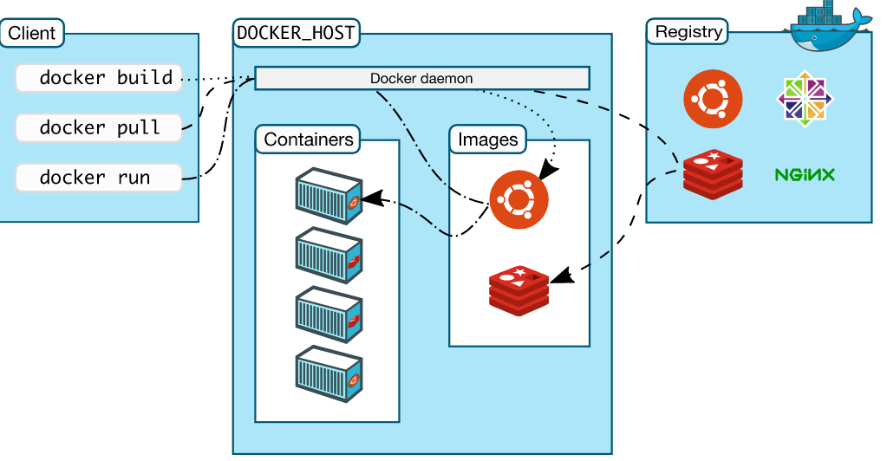

# Docker 基础

这里记录着一些Docker相关的知识

## Dcoekr常用命令




## Docker流程

**Docker** 包括三个基本概念：

-  镜像（`Image`）：Docker 镜像是一个特殊的文件系统，除了提供[容器](https://cloud.tencent.com/product/tke?from_column=20065&from=20065)运行时所需的程序、库、资源、配置等文件外，还包含了一些为运行时准备的一些配置参数（如匿名卷、环境变量、用户等）。镜像不包含任何动态数据，其内容在构建之后也不会被改变。 
-  容器（`Container`）：镜像（`Image`）和容器（`Container`）的关系，就像是面向对象程序设计中的 `类` 和 `实例` 一样，镜像是静态的定义，容器是镜像运行时的实体。容器可以被创建、启动、停止、删除、暂停等。 
-  仓库（`Repository`）：仓库（`Repository`）类似Git的远程仓库，集中存放镜像文件。 

三者关系可以用下图表示：





---

## Docker服务

启动docker

```shell
systemctl start docker
```

关闭docker

```shell
systemctl stop docker
```

设置开机启动

```shell
systemctl enable docker
```

重启Docker服务

```shell
service docker restart
```

关闭docker服务

```shell
service docker stop
```

查看docker版本信息

```shell
docker version
```


---

## 镜像

### 镜像仓库

搜索镜像

```shell
docker search tomcat
```

拉去镜像

```shell
docker pull tomcat
```

不加tag的情况下，默认拉去latest（最新版本）

::: tip

指定版本号, 格式如下:
docker pull 镜像名:版本号

:::

---

### 镜像管理

列出镜像

```shell
docker images
```

删除镜像

```shell
docker rmi mysql:5.7

# or

docker rmi 2be84dd575ee
```

::: tip

为了准确删除你的目标镜像, 建议删除有多个版本存在的镜像时, 使用镜像名:版本号, 如果二者镜像 `ID` 不同也可以使用镜像 `ID` 进行删除, 防止误删

:::

导出镜像

```shell
# docker save -o 给导出的镜像压缩包起个文件名 要导出的镜像名:版本号
docker save -o image.tar target_image:tag
```

导入镜像

```shell
# docker load -i 指定要导入的镜像压缩包文件名
docker load -i image.tar
```

::: tip

如果用镜像 `ID` 导出的镜像在导入之后是没有名字和`tag`的, 这种情况我们可以使用 `docker tag` 给镜像改名字

```shell
docker tag image_id new_image_name:tag
```

:::

---

### 使用Dockerfile构建镜像

```shell

# docker build -t 镜像名:版本号 .  注意最后边的点 `.` 表示当前目录, 别丢了.
docker build -t my_image:1.0 .
```

::: tip

`Docker` `build` 命令可以使用 `Dockerfile` 来构建镜像。默认情况下，`Dockerfile` 文件位于构建上下文的根目录下，因此 `docker build` 命令会自动读取上下文根路径下名为 `Dockerfile` 的文件。如果 `Dockerfile` 文件不在根目录下，可以使用 `-f` 选项来指定 `Dockerfile` 文件的路径。例如，以下命令将使用 `/path/to/Dockerfile` 文件构建镜像：

`docker build -f /path/to/Dockerfile -t image_name:tag .`

其中，

- `.` 表示当前目录.
- `-f` , `--file` Name of the Dockerfile (Default is PATH/Dockerfile)
- `-t` , `--tag` Name and optionally a tag in the name:tag format

::: 

`Dockerfile` 简单列举几个指令:

- `FROM` : 指定基础镜像
- `WORKDIR` : 指定工作目录
- `COPY` : 将文件或者目录从构建上下文复制到容器中(推荐)
- `ADD` : 将文件或者目录从构建上下文复制到容器中,并且会将压缩文件解压缩,支持 `URL`
- `RUN` : 在容器中执行命令
- `CMD` : 容器启动时执行的命令
- `EXPOSE` : 指定要监听的端口以实现与外部通信

---

## 容器

进入容器

```shell
# 使用容器名
docker exec -it my_container /bin/bash

# or
# 使用容器ID
docker exec -it container_id /bin/bash
```

查看容器信息

```shell
# 容器名
docker inspect my_container

# or
# 容器ID
docker inspect container_id
```

将容器中目录或文件拷贝到宿主机

```shell
# 将容器中 /app/html 目录拷贝到宿主机 /mnt/ 目录中
docker cp container_id:/app/html /mnt/
# 将容器中 /app/html/index.html 文件拷贝到宿主机 /mnt/dist/ 目录中
docker cp container_id:/app/html/index.html /mnt/dist/
```

将宿主机`/mnt/dist`目录拷贝到容器中, 并重命名为`html`

```shell
# 将宿主机 /mnt/dist 目录拷贝到容器的 /app/ 中重命名为 html
docker cp /mnt/dist container_id:/app/html
# 将宿主机 /mnt/dist/index1.html 文件拷贝到容器的 /app/html/ 中重命名为 index.html
docker cp /mnt/dist/index1.html container_id:/app/html/index.html
```

---

## 数据卷

使用docker容器的时候，会产生一系列的数据文件，这些数据文件在删除docker容器时是会消失的，但是其中产生的部分内容是希望能够把它给保存起来另作用途的，Docker将应用与运行环境打包成容器发布，程序员希望在运行过程钟产生的部分数据是可以持久化的的，而且容器之间我们希望能够实现数据共享。

一般地来说，docker容器数据卷可以看成常用的u盘，它存在于一个或多个的容器中，由docker挂载到容器，但不属于联合文件系统，Docker不会在容器删除时删除其挂载的数据卷。

### 数据卷的特点

- 1. 数据卷可以在容器之间共享或重用数据
- 1. 数据卷中的更改可以立即生效
- 1. 数据卷中的更改不会包含在镜像的更新中
- 1. 数据卷默认会一直存在，即使容器被删除
- 1. 数据卷的生命周期一直持续到没有容器使用它为止

### 基本使用

语法

```bash
docker run -v /宿主机绝对路径目录:/容器内目录 镜像名
```

```bash
docker run -itd --name mysql --restart always --privileged=true -p 3306:3306 -e MYSQL_ROOT_PASSWORD=admin
-v /data/mysql:/var/lib/mysql mysql:5.7.31 --character-set-server=utf8 --collation-server=utf8_general_ci
```

容器目录权限

```bash
通过 -v 容器内路径: ro rw 改变读写权限 ro:readonly 只读

rw:readwrite 可读可写

docker run -it -v /宿主机绝对路径目录:/容器内目录:ro 镜像名

docker run -it -v /宿主机绝对路径目录:/容器内目录:rw 镜像名

例如:

docker run -d -P --name nginx05 -v nginx1:/etc/nginx:ro nginx

docker run -d -P --name nginx05 -v nginx2:/etc/nginx:rw nginx

ro 只要看到ro就说明这个路径只能通过宿主机来操作，容器内部是无法操作!
```

