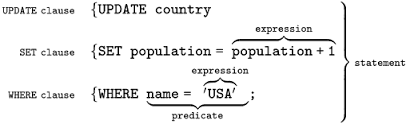

# SQL语法基础

> 参考：[SQL 语法速成手册数据库（database） - 保存有组织的数据的容器（通常是一个文件或一组文件）。 数据表（tab - 掘金](https://juejin.cn/post/6844903790571700231)
>
> [SQL语法基础知识总结 | JavaGuide](https://javaguide.cn/database/sql/sql-syntax-summary.html)
>
> [数据库表连接的简单解释 - 阮一峰的网络日志](https://www.ruanyifeng.com/blog/2019/01/table-join.html)

SQL（Structured Query Language)，标准 SQL 由 ANSI 标准委员会管理，从而称为 ANSI SQL。各个 DBMS 都有自己的实现，如 PL/SQL、Transact-SQL 等。

---

## 数据库术语

- `数据库（database）` - 保存有组织的数据的容器（通常是一个文件或一组文件）。

- `数据表（table）` - 某种特定类型数据的结构化清单。

- `模式（schema）` - 关于数据库和表的布局及特性的信息。模式定义了数据在表中如何存储，包含存储什么样的数据，数据如何分解，各部分信息如何命名等信息。数据库和表都有模式。

- `列（column）` - 表中的一个字段。所有表都是由一个或多个列组成的。

- `行（row）` - 表中的一个记录。

- `主键（primary key）` - 一列（或一组列），其值能够唯一标识表中每一行。

------

## SQL语法结构



SQL 语法结构包括：

- **`子句`** - 是语句和查询的组成成分。（在某些情况下，这些都是可选的。）
- **`表达式`** - 可以产生任何标量值，或由列和行的数据库表
- **`谓词`** - 给需要评估的 SQL 三值逻辑（3VL）（true/false/unknown）或布尔真值指定条件，并限制语句和查询的效果，或改变程序流程。
- **`查询`** - 基于特定条件检索数据。这是 SQL 的一个重要组成部分。
- **`语句`** - 可以持久地影响纲要和数据，也可以控制数据库事务、程序流程、连接、会话或诊断。

#### SQL 语法要点

- **SQL 语句不区分大小写**，但是数据库表名、列名和值是否区分，依赖于具体的 DBMS 以及配置。例如：`SELECT` 与 `select`、`Select` 是相同的。
- **多条 SQL 语句必须以分号（`;`）分隔**。
- 处理 SQL 语句时，**所有空格都被忽略**。

------

SQL 语句可以写成一行，也可以分写为多行。

```sql
-- 一行 SQL 语句

UPDATE user SET username='robot', password='robot' WHERE username = 'root';

-- 多行 SQL 语句
UPDATE user
SET username='robot', password='robot'
WHERE username = 'root';
```

SQL 支持三种注释：

```sql
## 注释1
-- 注释2
/* 注释3 */
```

---

## SQL分类

#### SQL 分类

#### 数据定义语言（DDL）

数据定义语言（Data Definition Language，DDL）是 SQL 语言集中负责数据结构定义与数据库对象定义的语言。

DDL 的主要功能是**定义数据库对象**。

DDL 的核心指令是 `CREATE`、`ALTER`、`DROP`。

#### 数据操纵语言（DML）

数据操纵语言（Data Manipulation Language, DML）是用于数据库操作，对数据库其中的对象和数据运行访问工作的编程语句。

DML 的主要功能是 **访问数据**，因此其语法都是以**读写数据库**为主。

DML 的核心指令是 `INSERT`、`UPDATE`、`DELETE`、`SELECT`。这四个指令合称 CRUD(Create, Read, Update, Delete)，即增删改查。

#### 事务控制语言（TCL）

事务控制语言 (Transaction Control Language, TCL) 用于**管理数据库中的事务**。这些用于管理由 DML 语句所做的更改。它还允许将语句分组为逻辑事务。

TCL 的核心指令是 `COMMIT`、`ROLLBACK`。

#### 数据控制语言（DCL）

数据控制语言 (Data Control Language, DCL) 是一种可对数据访问权进行控制的指令，它可以控制特定用户账户对数据表、查看表、预存程序、用户自定义函数等数据库对象的控制权。

DCL 的核心指令是 `GRANT`、`REVOKE`。

DCL 以**控制用户的访问权限**为主，因此其指令作法并不复杂，可利用 DCL 控制的权限有：`CONNECT`、`SELECT`、`INSERT`、`UPDATE`、`DELETE`、`EXECUTE`、`USAGE`、`REFERENCES`。

根据不同的 DBMS 以及不同的安全性实体，其支持的权限控制也有所不同。

---

## 增删改查

> 增删改查，又称为CRUD,数据库基本操作中的基本操作

### 插入数据

> INSERT INTO 语句用于向表中插入新记录

**插入完整的行**

```sql
INSERT INTO user
VALUES (10, 'root', 'root', 'xxxx@163.com');
```

这语句的作用是在`user`表中创建一条新记录，记录了一个用户的信息

**插入行的一部分**

```sql
INSERT INTO user(username, password, email)
VALUES ('admin', 'admin', 'xxxx@163.com');
```

**插入查询出来的数据**

```sql
INSERT INTO user(username)
SELECT name
FROM account;
```

这段 SQL 代码是一条`INSERT`语句，其作用是将`account`表中的`name`字段的值插入到`user`表的`username`字段中。

### 更新数据

`UPDATE` 语句用于更新表中的记录。

```sql
UPDATE user
SET username='robot', password='robot'
WHERE username = 'root';
```

### 删除数据

- `DELETE` 语句用于删除表中的记录。
- `TRUNCATE TABLE` 可以清空表，也就是删除所有行。

**删除表中的指定数据**

```sql
DELETE FROM user
WHERE username = 'robot';
```

用于从名为 `user` 的表中删除满足特定条件的记录。这个条件是 `username = 'robot'`，即删除所有`username` 为 `robot` 的记录。

**清空表中的数据**

```sql
TRUNCATE TABLE user;
```

### 查询数据

`SELECT` 语句用于从数据库中查询数据。

`DISTINCT` 用于返回唯一不同的值。它作用于所有列，也就是说所有列的值都相同才算相同。

`LIMIT` 限制返回的行数。可以有两个参数，第一个参数为起始行，从 0 开始；第二个参数为返回的总行数。

- `ASC`：升序（默认）
- `DESC`：降序

**查询单列**

```sql
SELECT prod_name
FROM products;
```

**查询多列**

```sql
SELECT prod_id, prod_name, prod_price
FROM products;
```

**查询所有列**

```sql
ELECT *
FROM products;
```

**查询不同的值**

```sql
SELECT DISTINCT
vend_id FROM products;
```

**限制查询结果**

```sql
-- 返回前 5 行
SELECT * FROM mytable LIMIT 5;
SELECT * FROM mytable LIMIT 0, 5;
-- 返回第 3 ~ 5 行
SELECT * FROM mytable LIMIT 2, 3;
```

---

## 子查询

> 子查询是嵌套在较大查询中的 SQL 查询。子查询也称为**内部查询**或**内部选择**，而包含子查询的语句也称为**外部查询**或**外部选择**。

子查询可以嵌套在 `SELECT`，`INSERT`，`UPDATE` 或 `DELETE` 语句内或另一个子查询中。

子查询通常会在另一个 `SELECT` 语句的 `WHERE` 子句中添加。

您可以使用比较运算符，如 `>`，`<`，或 `=`。比较运算符也可以是多行运算符，如 `IN`，`ANY` 或 `ALL`。

子查询必须被圆括号 `()` 括起来。

内部查询首先在其父查询之前执行，以便可以将内部查询的结果传递给外部查询。执行过程可以参考下图：

**子查询的子查询**

```sql
SELECT cust_name, cust_contact
FROM customers
WHERE cust_id IN (SELECT cust_id
                  FROM orders
                  WHERE order_num IN (SELECT order_num
                                      FROM orderitems
                                      WHERE prod_id = 'RGAN01'));
```

### WHERE

- `WHERE` 子句用于过滤记录，即缩小访问数据的范围。
- `WHERE` 后跟一个返回 `true` 或 `false` 的条件。
- `WHERE` 可以与 `SELECT`，`UPDATE` 和 `DELETE` 一起使用。
- 可以在 `WHERE` 子句中使用的操作符

| 运算符  | 描述                                                   |
| ------- | ------------------------------------------------------ |
| =       | 等于                                                   |
| <>      | 不等于。注释：在 SQL 的一些版本中，该操作符可被写成 != |
| >       | 大于                                                   |
| <       | 小于                                                   |
| >=      | 大于等于                                               |
| <=      | 小于等于                                               |
| BETWEEN | 在某个范围内                                           |
| LIKE    | 搜索某种模式                                           |
| IN      | 指定针对某个列的多个可能值                             |

**`SELECT` 语句中的 `WHERE` 子句**

```sql
SELECT * FROM Customers
WHERE cust_name = 'Kids Place';
```

**`UPDATE` 语句中的 `WHERE` 子**

```sql
UPDATE Customers
SET cust_name = 'Jack Jones'
WHERE cust_name = 'Kids Place';
```

**`UPDATE` 语句中的 `WHERE` 子句**

```sql
UPDATE Customers
SET cust_name = 'Jack Jones'
WHERE cust_name = 'Kids Place';
```

**`DELETE` 语句中的 `WHERE` 子句**

```sql
DELETE FROM Customers
WHERE cust_name = 'Kids Place';
```

### IN 和 BETWEEN

- `IN` 操作符在 `WHERE` 子句中使用，作用是在指定的几个特定值中任选一个值。
- `BETWEEN` 操作符在 `WHERE` 子句中使用，作用是选取介于某个范围内的值。

**IN 示例**

```sql
SELECT *
FROM products
WHERE vend_id IN ('DLL01', 'BRS01');
```

**BETWEEN 示例**

```sql
SELECT *
FROM products
WHERE prod_price BETWEEN 3 AND 5;
```

### AND、OR、NOT

- `AND`、`OR`、`NOT` 是用于对过滤条件的逻辑处理指令。
- `AND` 优先级高于 `OR`，为了明确处理顺序，可以使用 `()`。
- `AND` 操作符表示左右条件都要满足。
- `OR` 操作符表示左右条件满足任意一个即可。
- `NOT` 操作符用于否定一个条件。

**AND 示例**

```sql
SELECT prod_id, prod_name, prod_price
FROM products
WHERE vend_id = 'DLL01' AND prod_price <= 4;
```

**OR 示例**

```sql
SELECT prod_id, prod_name, prod_price
FROM products
WHERE vend_id = 'DLL01' OR vend_id = 'BRS01';
```

**NOT 示例**

```sql
SELECT *
FROM products
WHERE prod_price NOT BETWEEN 3 AND 5;
```

### LIKE

- `LIKE` 操作符在 `WHERE` 子句中使用，作用是确定字符串是否匹配模式。
- 只有字段是文本值时才使用 `LIKE`。
- `LIKE` 支持两个通配符匹配选项：`%` 和 `_`。
- 不要滥用通配符，通配符位于开头处匹配会非常慢。
- `%` 表示任何字符出现任意次数。
- `_` 表示任何字符出现一次。

**% 示例**

```sql
SELECT prod_id, prod_name, prod_price
FROM products
WHERE prod_name LIKE '%bean bag%';
```

**_ 示例**

```sql
SELECT prod_id, prod_name, prod_price
FROM products
WHERE prod_name LIKE '__ inch teddy bear';
```

---

## 连接和组合

### 连接（JOIN）

关系型数据库最难的地方，就是建模（model）。

错综复杂的数据，需要建立模型，才能储存在数据库。**所谓"模型"就是两样东西：实体（entity）+ 关系（relationship）。**

实体指的是那些实际的对象，带有自己的属性，可以理解成一组相关属性的容器。关系就是实体之间的联系，通常可以分成"一对一"、"一对多"和"多对多"等类型。


在关系型数据库里面，每个实体有自己的一张表（table），所有属性都是这张表的字段（field），表与表之间根据关联字段"连接"（join）在一起。所以，表的连接是关系型数据库的核心问题。


表的连接分成好几种类型。

- 内连接（inner join）
- 外连接（outer join）
- 左连接（left join）
- 右连接（right join）
- 全连接（full join）

**所谓"连接"，就是两张表根据关联字段，组合成一个数据集。**问题是，两张表的关联字段的值往往是不一致的，如果关联字段不匹配，怎么处理？比如，表 A 包含张三和李四，表 B 包含李四和王五，匹配的只有李四这一条记录。

很容易看出，一共有四种处理方法。

- 只返回两张表匹配的记录，这叫内连接（inner join）。
- 返回匹配的记录，以及表 A 多余的记录，这叫左连接（left join）。
- 返回匹配的记录，以及表 B 多余的记录，这叫右连接（right join）。
- 返回匹配的记录，以及表 A 和表 B 各自的多余记录，这叫全连接（full join）。

这四种连接，又可以分成两大类：内连接（inner join）表示只包含匹配的记录，外连接（outer join）表示还包含不匹配的记录。所以，左连接、右连接、全连接都属于外连接。

这四种连接的 SQL 语句如下。

```sql

SELECT * FROM A  
INNER JOIN B ON A.book_id=B.book_id;

SELECT * FROM A  
LEFT JOIN B ON A.book_id=B.book_id;

SELECT * FROM A  
RIGHT JOIN B ON A.book_id=B.book_id;

SELECT * FROM A  
FULL JOIN B ON A.book_id=B.book_id;
```

### 组合（UNION）

- `UNION` 运算符将两个或更多查询的结果组合起来，并生成一个结果集，其中包含来自 `UNION` 中参与查询的提取行。

- ```
  UNION
  ```

   基本规则

  - 所有查询的列数和列顺序必须相同。
  - 每个查询中涉及表的列的数据类型必须相同或兼容。
  - 通常返回的列名取自第一个查询。

- 默认会去除相同行，如果需要保留相同行，使用 `UNION ALL`。

- 只能包含一个 `ORDER BY` 子句，并且必须位于语句的最后。

- 应用场景

  - 在一个查询中从不同的表返回结构数据。
  - 对一个表执行多个查询，按一个查询返回数据。

**组合查询**

```sql
SELECT cust_name, cust_contact, cust_email
FROM customers
WHERE cust_state IN ('IL', 'IN', 'MI')
UNION
SELECT cust_name, cust_contact, cust_email
FROM customers
WHERE cust_name = 'Fun4All';
```

### JOIN vs UNION

- JOIN vs UNION
  - `JOIN` 中连接表的列可能不同，但在 `UNION` 中，所有查询的列数和列顺序必须相同。
  - `UNION` 将查询之后的行放在一起（垂直放置），但 `JOIN` 将查询之后的列放在一起（水平放置），即它构成一个笛卡尔积。

---

